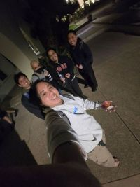

+++
date = '2026-07-24T15:47:25-07:00'
draft = false
title = 'SDSU Undergrad'
+++

I attended San Diego State University for my undergraduate from 2022-2026, and although I kept mostly to myself, I strived to take a variety of courses in both computer science and philosophy. I didn't take leadership positions in clubs, nor did I take positions as a teaching assistant.

### Computer Science Courses ###
- Computational Linguistics
- Networks & Distributed Systems
- 3d Game Programming
- Unix System Administration
- Operating Systems
- Computer Architecture
- Machine Learning
- Cryptography & Blockchain
- Intro to Software Systems
- Algorithms
- Database Theory and Implementation

### Philosophy Courses ###
- Metaphysics
- Asian Philosophies
- Philosophy of Language
- 19th-Century European Philosophy
- History of Philosophy from Ancient times to 18th century
- Deductive Logic
- Philosophy, Behavior, and the Internet
- Morality of War & Peace

I graduated with distinction in both degrees and was awarded summa cum laude. I enjoyed learning about **operating systems**, **computational linguistics**, and **computer networks**. The most fun class was **3d game programming** because of my cool teammates (we won [most well-liked game](https://github.com/ijustin125i/UndeclaredAdventures.git) via classroom vote; later we would create another [game with multiplayer capabilities](https://github.com/east-01/CalculatedCollapse.git)). I also enjoyed **Metaphysics**, **History of Philosophy**, and **Philosophy of Language**. With philosophy, the most fun I had was in philosophy club where I got to hear my classmates' opinions outside of the classroom.

My favorite philosophy professors were **Prof. Reyes**, **Dr. Neuner**, and **Dr. Francescotti**. My favorite computer science professors were **Dr. Wang**, **Dr. Umut Can Çabuk**, **Prof. Ramamoorthy**. There were also a few classmates who I admired because of their work ethic and behavior (we repeatedly took the same classes) .